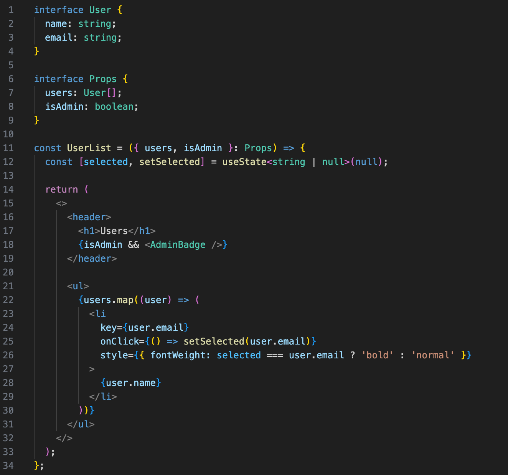
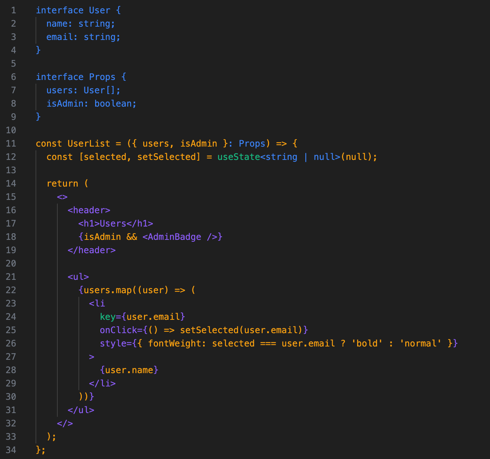

# Why React Code Looks Like That

A VS Code extension that visualizes which parts of TSX/JSX code come from JavaScript, TypeScript, JSX, or React. Designed as an educational tool to help developers understand the layered syntax of modern React code.

This extension accompanies the blog post ["Why React Code Looks Like That"](https://www.dfrancour.dev/blog/why-react-code-looks-like-that).

| Before | After |
|--------|-------|
|  |  |

## Usage

1. Open a `.tsx` or `.jsx` file
2. Run the command **"Why React Code Looks Like That - Toggle Highlighting"** from the command palette (Cmd/Ctrl+Shift+P)
3. Code is colored by origin technology
4. A legend panel appears in the Explorer sidebar with a "Turn Off" button

## Colors

| Layer      | Default Color | Description |
|------------|---------------|-------------|
| JavaScript | Amber `#f59e0b` | Base language: variables, functions, operators, literals |
| JSX        | Violet `#8b5cf6` | Syntax extension: tags, attributes, fragments |
| TypeScript | Blue `#3b82f6` | Type system: interfaces, type annotations, generics |
| React      | Emerald `#10b981` | Library-specific: hooks, `key` prop, React types |

## How It Works

The extension uses the TypeScript Compiler API to parse TSX/JSX files into an Abstract Syntax Tree (AST). It then walks the tree and classifies each node based on its `SyntaxKind`. When regions overlap, a priority system resolves conflicts: React > TypeScript > JSX > JavaScript.

The result is a flat list of non-overlapping regions, each tagged with its origin layer. These regions are then rendered as VS Code text decorations.

## Configuration

Colors are customizable in VS Code settings:

```json
{
  "whyReactCodeLooksLikeThat.colors.javascript": "#f59e0b",
  "whyReactCodeLooksLikeThat.colors.jsx": "#8b5cf6",
  "whyReactCodeLooksLikeThat.colors.typescript": "#3b82f6",
  "whyReactCodeLooksLikeThat.colors.react": "#10b981"
}
```

## Development

```bash
pnpm install
pnpm run compile
# Press F5 in VS Code to launch Extension Development Host
```

## License

MIT
